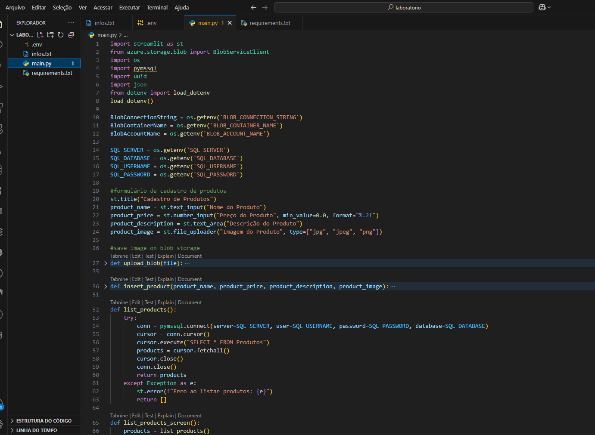
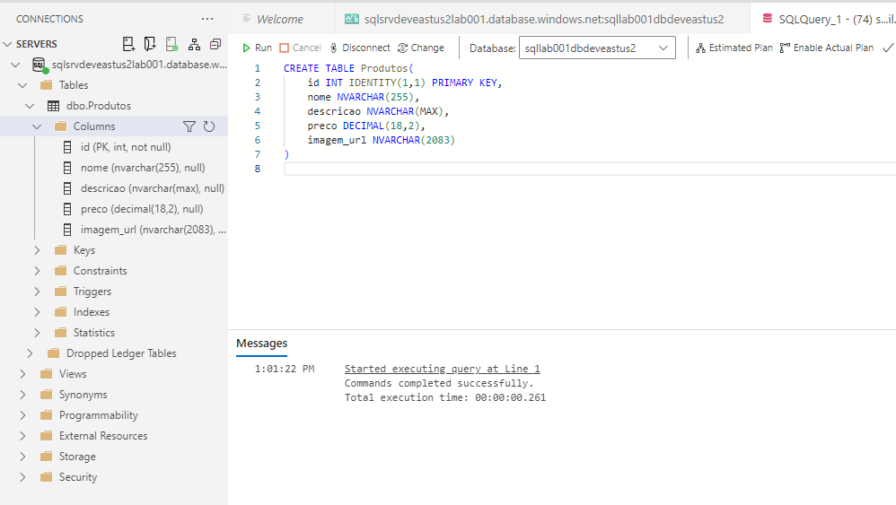
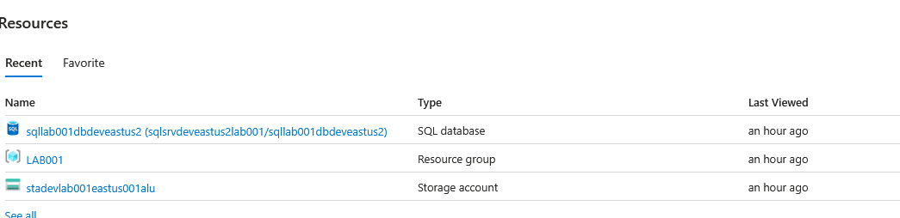

# ecommerce-cloud
Armazenando dados de um E-Commerce na Cloud

Um pouco do código aplicado para cadastrar e exibir o produto cadastrado.
Os arquivos que foram criados para configuração e comunicação com o banco de dados

Criado todo banco de dados na cloud e acessado via Azure Data Studio

Resources criados para trabalhar com o cloud.

Nesse curso foi aprendido bastante sobre a comunicação do cloud, banco de dados SQL SERVER e um pouco sobre python na prática.
Desenvolvi habilidades que ainda não tinha e consegui resolver alguns problemas ocasionais que tinham dentro do Azure.